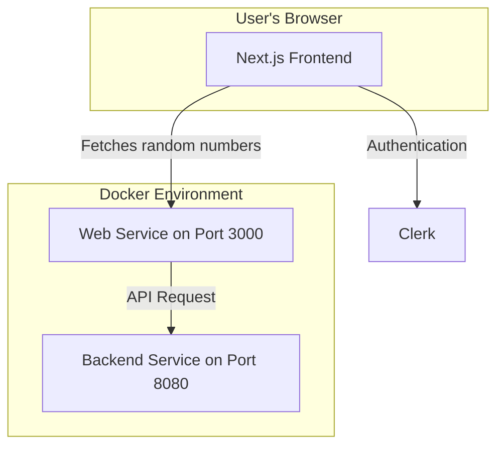
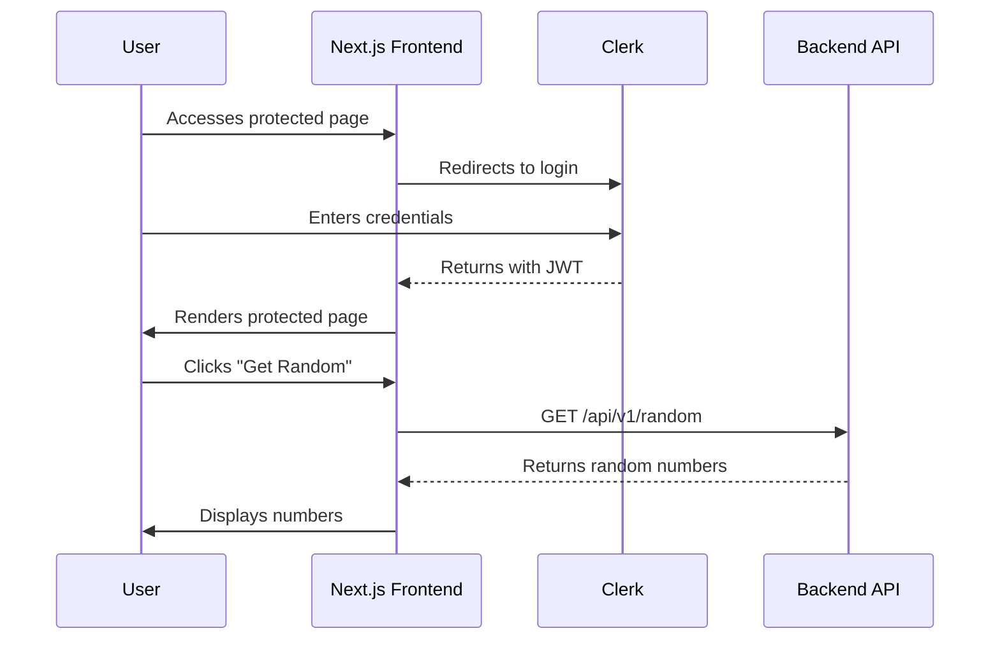

# RJA Fecit

This project is a modern, production-ready web application built with a Next.js front-end and a FastAPI back-end. The front-end features a single, protected page that, after authentication via Clerk, allows users to fetch and display a list of random numbers from the back-end.

## Features

- **Front-end:** Next.js 14 with App Router, React 18, TypeScript, Tailwind CSS, and daisyUI.
- **Back-end:** FastAPI with Python 3.12.
- **Authentication:** Clerk for user authentication.
- **Containerization:** Docker and Docker Compose for local development and production builds.
- **Development Tools:** ESLint, Prettier, Husky, lint-staged, Vitest, React Testing Library, and k6 for load testing.
- **CI/CD:** GitHub Actions for continuous integration and release management.

## Architecture

### High-Level Architecture



### Authentication Flow



## Getting Started

### Prerequisites

- [Node.js](https://nodejs.org/) (v20 or later)
- [pnpm](https://pnpm.io/)
- [Docker](https://www.docker.com/) and [Docker Compose](https://docs.docker.com/compose/)

### Environment Variables

Create a `.env.local` file in the root of the project by copying the `.env.example` file:

```bash
cp .env.example .env.local
```

You will need to add your Clerk credentials to this file:

```dotenv
# Clerk Keys
NEXT_PUBLIC_CLERK_PUBLISHABLE_KEY=your_clerk_publishable_key
CLERK_SECRET_KEY=your_clerk_secret_key

1. Log in to https://dashboard.clerk.com → select your app.
2. Open API Keys in the left-hand navigation.

# API Configuration
RANDOM_API_BASE=http://backend:8080

# Port Configuration
PORT=3000
```

### Installation and Running

#### Local Development (pnpm)

1.  **Install dependencies:**
    ```bash
    pnpm install
    ```

2.  **Run the development server:**
    This will start the Next.js front-end and the FastAPI back-end concurrently.
    ```bash
    pnpm dev
    ```

    The application will be available at `http://localhost:3000`.

#### Docker

1.  **Build the Docker images:**
    ```bash
    ./docker/scripts/build.sh
    ```

2.  **Start the services:**
    ```bash
    ./docker/scripts/start.sh
    ```

    The application will be available at `http://localhost:3000`.

## Scripts

- `pnpm dev`: Starts the development server.
- `pnpm build`: Builds the application for production.
- `pnpm start`: Starts the production server.
- `pnpm lint`: Lints the codebase.
- `pnpm test`: Runs unit and integration tests.
- `pnpm test:e2e`: Runs end-to-end tests.
- `pnpm load-test`: Runs a load test with k6.
