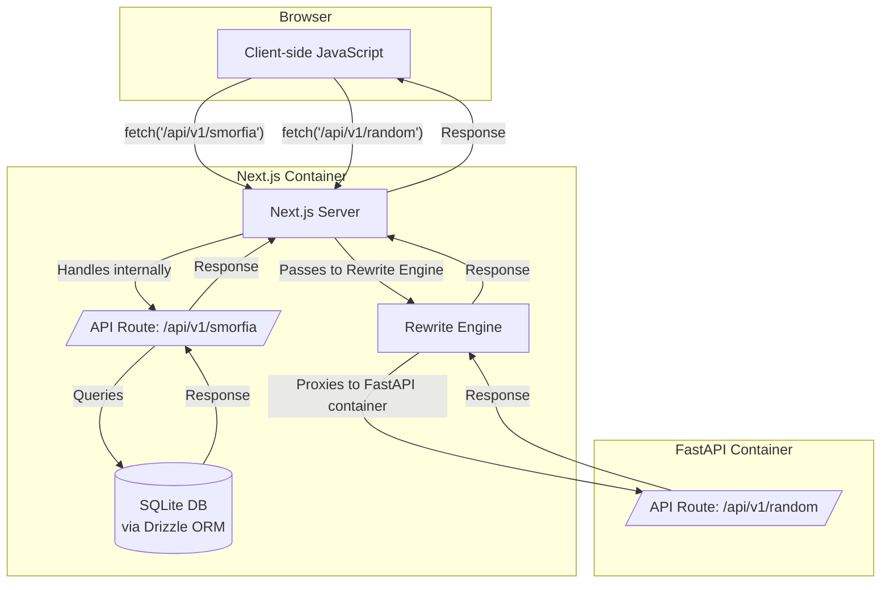
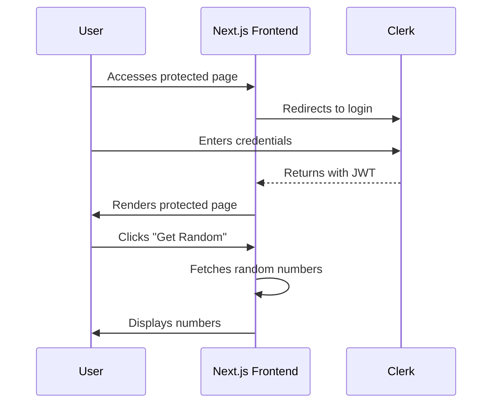

# RJA Fecit

This project is a modern, production-ready web application built with a Next.js front-end and a FastAPI back-end. The front-end features a single, protected page that, after authentication via Clerk, allows users to fetch and display a list of random numbers from the back-end.

## Features

- **Front-end:** Next.js 14 with App Router, React 18, TypeScript, Tailwind CSS, and daisyUI.
- **Back-end:** FastAPI with Python 3.12.
- **Database:** SQLite with Drizzle ORM for data persistence and schema management.
- **Authentication:** Clerk for user authentication.
- **Containerization:** Docker and Docker Compose for local development and production builds.
- **Development Tools:** ESLint, Prettier, Husky, lint-staged, Vitest, React Testing Library, and k6 for load testing.
- **CI/CD:** GitHub Actions for continuous integration and release management.

## Architecture

### High-Level Architecture



### Backend API

The application uses two different backend endpoints to provide data to the frontend:

-   **/api/v1/random**: This endpoint is proxied by the Next.js server to the FastAPI backend service running in a separate Docker container. The Next.js `rewrites` configuration handles this proxying, which avoids CORS issues and keeps the frontend code clean, as it can call a relative path.

-   **/api/v1/smorfia**: This endpoint is a standard Next.js API route, served directly by the Next.js server. It queries the SQLite database using Drizzle ORM to fetch and return the Smorfia Napoletana data to the frontend.

### Database Architecture

The application uses SQLite as its database with Drizzle ORM for type-safe database operations:

- **Database Location**: `data/smorfia.db` (SQLite file)
- **ORM**: Drizzle ORM with LibSQL client
- **Schema Management**: TypeScript-based schema definitions with migration support
- **Data**: 90 entries of traditional Neapolitan Smorfia numbers and meanings

### Authentication Flow



## Getting Started

### Prerequisites

- [Node.js](https://nodejs.org/) (v20 or later)
- [pnpm](https://pnpm.io/)
- [Docker](https://www.docker.com/) and [Docker Compose](https://docs.docker.com/compose/)

### Environment Variables

This project requires two separate environment files for local development and Docker-based development.

#### Local Development (`.env.local`)

For running the application locally with `pnpm`, create a `.env.local` file by copying the example:

```bash
cp .env.example .env.local
```

Update `.env.local` with your Clerk credentials and ensure the backend API URL is set to `http://localhost:8080`:

```dotenv
# .env.local

# Clerk Keys
NEXT_PUBLIC_CLERK_PUBLISHABLE_KEY=your_clerk_publishable_key
CLERK_SECRET_KEY=your_clerk_secret_key

# API Configuration
NEXT_PUBLIC_BACKEND_API_BASE=http://localhost:8080

# Port Configuration
PORT=3000
```

#### Docker Development (`.env.docker`)

For running the application with Docker, create a `.env.docker` file:

```bash
cp .env.example .env.docker
```

Update `.env.docker` with your Clerk credentials. The backend API URL must be set to `http://backend:8080` to allow the front-end container to communicate with the back-end container:

```dotenv
# .env.docker

# Clerk Keys
NEXT_PUBLIC_CLERK_PUBLISHABLE_KEY=your_clerk_publishable_key
CLERK_SECRET_KEY=your_clerk_secret_key

# API Configuration
NEXT_PUBLIC_BACKEND_API_BASE=http://backend:8080

# Port Configuration
PORT=3000
```

**To get your Clerk credentials:**
1. Log in to https://dashboard.clerk.com → select your app.
2. Open API Keys in the left-hand navigation.

### Installation and Running

#### Local Development (pnpm)

1.  **Install dependencies:**
    ```bash
    pnpm install
    ```

2.  **Set up the database:**
    ```bash
    # Generate database migrations
    pnpm db:generate
    
    # Run migrations to create tables
    pnpm db:migrate
    
    # Seed the database with Smorfia data
    pnpm db:seed
    ```

3.  **Run the development server:**
    This will start the Next.js front-end and the FastAPI back-end concurrently.
    ```bash
    pnpm dev
    ```

    The application will be available at `http://localhost:3000`.

#### Docker

1.  **Build and run the Docker containers:**
    ```bash
    ./docker/buildrun.sh
    ```

    The application will be available at `http://localhost:3000`.

    **Note:** The Docker build process automatically handles database setup, including migration generation, table creation, and data seeding.

## Database Management

This project uses SQLite with Drizzle ORM for data persistence. The database setup includes:

### Database Schema

The database contains a single `smorfia` table with the following structure:

- `number` (INTEGER, PRIMARY KEY): The Smorfia number (1-90)
- `meaning` (TEXT, NOT NULL): The traditional meaning associated with the number

### Database Scripts

- `pnpm db:generate`: Generate SQL migration files from schema changes
- `pnpm db:migrate`: Apply pending migrations to the database
- `pnpm db:seed`: Populate the database with initial Smorfia data from JSON

### Database Location

- **Local Development**: `data/smorfia.db` (created automatically)
- **Docker**: Database file is built into the container and persisted via volume mount

### Schema Changes

To modify the database schema:

1. Update the schema definition in `lib/db/schema.ts`
2. Generate a new migration: `pnpm db:generate`
3. Apply the migration: `pnpm db:migrate`

The migration system ensures data integrity during schema updates.

### Data Loading

The initial database is populated from `data/smorfia_napoletana.json`. If you need to reload the data:

```bash
# Clear and reseed the database (development only)
rm data/smorfia.db
pnpm db:migrate
pnpm db:seed
```

## Backend Development

The FastAPI backend includes automatically generated documentation via Swagger UI. To access it, run the backend server and navigate to `http://localhost:8000/docs`.

```bash
pnpm dev:backend
```

## Scripts

- `pnpm dev`: Starts the Next.js development server.
- `pnpm dev:backend`: Starts the FastAPI backend server.
- `pnpm dev:all`: Starts both the Next.js and FastAPI servers concurrently.
- `pnpm build`: Builds the application for production.
- `pnpm start`: Starts the production server.
- `pnpm lint`: Lints the codebase.
- `pnpm test`: Runs unit and integration tests.
- `pnpm test:e2e`: Runs end-to-end tests.
- `pnpm load-test`: Runs a load test with k6.
- `pnpm db:generate`: Generate database migration files.
- `pnpm db:migrate`: Apply database migrations.
- `pnpm db:seed`: Seed database with initial data.
- `pnpm prepare`: Sets up Husky for pre-commit hooks.

## Docker Configuration

The Docker setup has been optimized for the SQLite database:

- **Database Persistence**: The `data` directory is mounted as a volume to persist the SQLite database across container restarts
- **Build-time Setup**: Database migrations and seeding occur during the Docker build process
- **Production Ready**: The container includes all necessary database files and dependencies

### Volume Mounting

The Docker Compose configuration mounts the `data` directory to ensure database persistence:

```yaml
volumes:
  - ../data:/app/data  # SQLite database persistence
```

This ensures that your database data persists even when containers are recreated.
